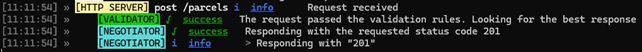
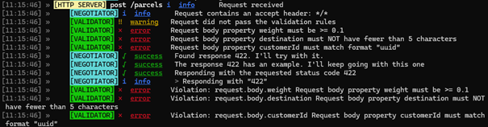
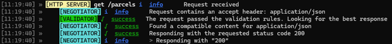
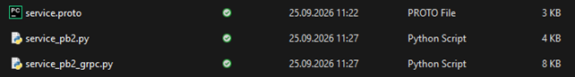

# Звіт про виконання лабораторної роботи №3
## Тема: Проєктування та специфікація АРІ (REST OpenAPI 3.0 та gRPC Proto3)
**Студент:** Сидорчук Даніл Олександрович
**Група:** [Вкажіть вашу групу]
**Тег у репозиторії:** lr3
**Посилання на репозиторій:** [Вставте URL вашого репозиторію]

### 1. Архітектурне позиціонування інтерфейсів
* **Призначення публічного REST API:** Використовується для клієнтських додатків (SPA/Mobile), через які користувачі відстежують свої посилки, а також для реєстрації нових відправлень.
* **Призначення внутрішнього gRPC API:** Використовується для високошвидкісної міжсервісної взаємодії, зокрема для потокової (streaming) передачі GPS-телеметрії від IoT-датчиків до ядра системи в реальному часі.

### 2. Специфікація REST API (OpenAPI 3.0)
* Посилання на файл: `api/openapi.yaml`
* **Таблиця ендпоінтів:**

| HTTP Method | Path | Опис | Коди відповідей |
| :--- | :--- | :--- | :--- |
| GET | `/parcels` | Отримати список вантажів (фільтрація, пагінація) | 200 |
| POST | `/parcels` | Реєстрація нового вантажу | 201, 400, 422 |
| GET | `/parcels/{parcelId}`| Отримати деталі вантажу | 200, 404 |
| PATCH | `/parcels/{parcelId}`| Оновити статус та IoT-телеметрію | 200, 400, 404 |
| DELETE | `/parcels/{parcelId}`| Скасувати відправлення | 204, 404 |

* **Опис застосування стандарту RFC 7807:** Усі помилки (400, 404, 422) типізовані за схемою `ProblemDetails` (application/problem+json), що гарантує наявність обов'язкових полів `type`, `title` та `status` замість неструктурованого тексту.
* **Скріншоти працездатності Prism Mock Server:**

### 3. Специфікація gRPC API (Protocol Buffers v3)
* Посилання на файл: `api/service.proto`
* **Опис сервісу та методів:** Спроєктовано `TrackingService`, який включає два Unary-методи (`GetParcelDetails`, `UpdateParcelStatus`) для базових CRUD-операцій та один Client Streaming метод (`StreamTelemetry`) для безперервного прийому координат. Використано сувору типізацію (`int64`, `double`), вкладені типи (`GeoLocation`) та `enum` із нульовим значенням за замовчуванням.
* **Генерація стабів:**

### 4. Порівняльний аналіз (JSON vs Protobuf Benchmark)
* **Таблиця розміру корисного навантаження:**

| Формат | Розмір корисного навантаження | Коефіцієнт стиснення |
| :--- | :--- | :--- |
| Текстовий JSON | ~270 байт | 1.0x (Базовий) |
| Бінарний Protobuf | ~95 байт | ~2.8x (Економія ~65%) |

* **Висновки щодо компромісів (Trade-offs):** Protobuf забезпечує високу швидкість обробки (низький CPU overhead) і значну економію трафіку, що є критичним для IoT-пристроїв. Однак, він програє JSON у читабельності людиною, що ускладнює зневадження (debugging) без наявності скомпільованих стабів.

### 5. Висновки
У ході лабораторної роботи було успішно застосовано підхід Contract-First для проєктування REST та gRPC API. Було розроблено специфікації для логістичної системи, налаштовано мок-сервер Prism, застосовано стандарт обробки помилок RFC 7807 та згенеровано серверні/клієнтські стаби, що повністю відповідає вимогам формування компетентності ПРН17.