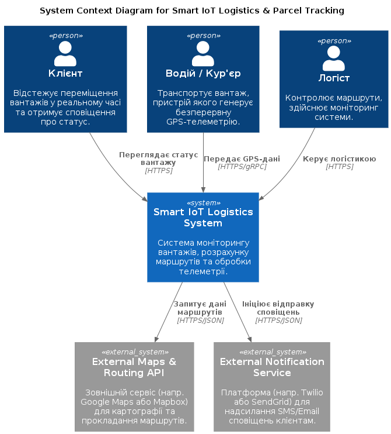
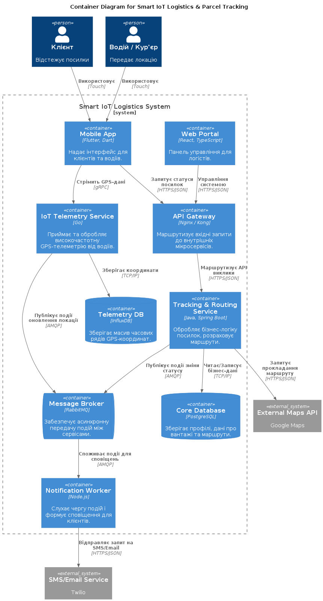
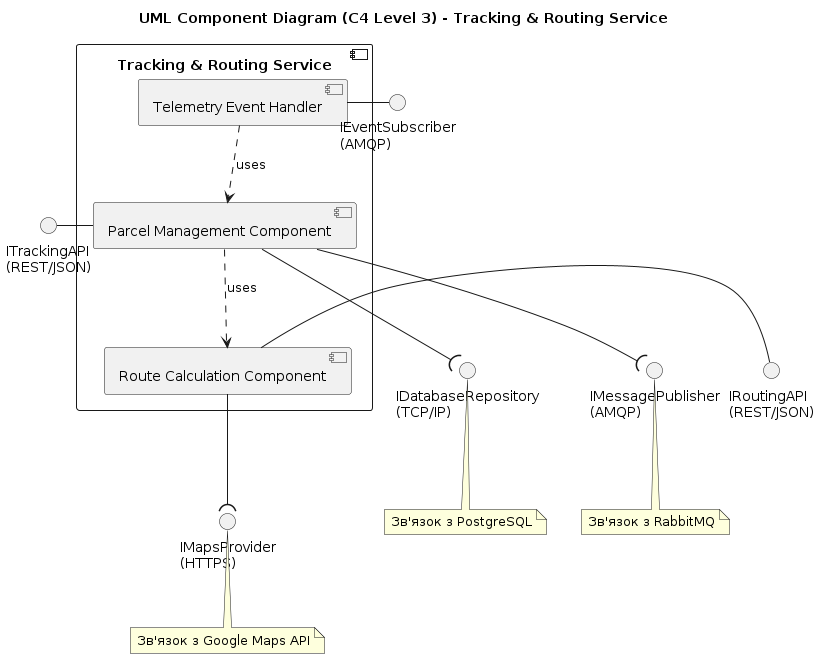
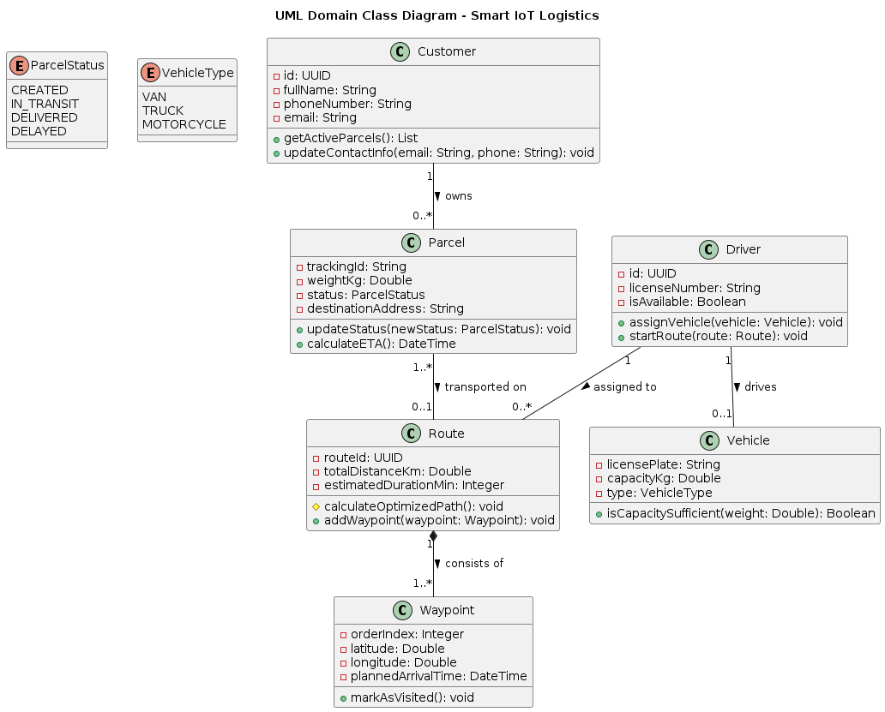
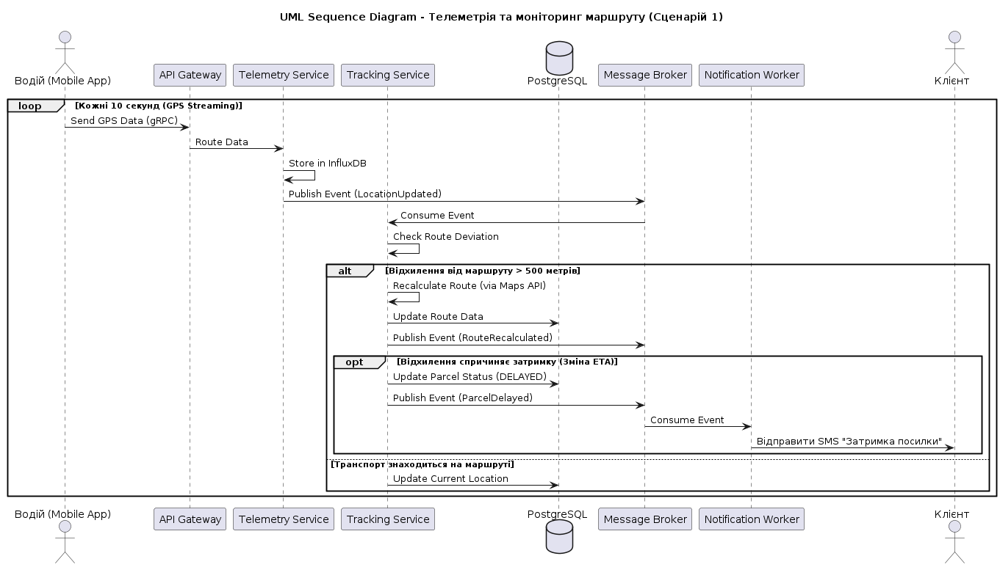
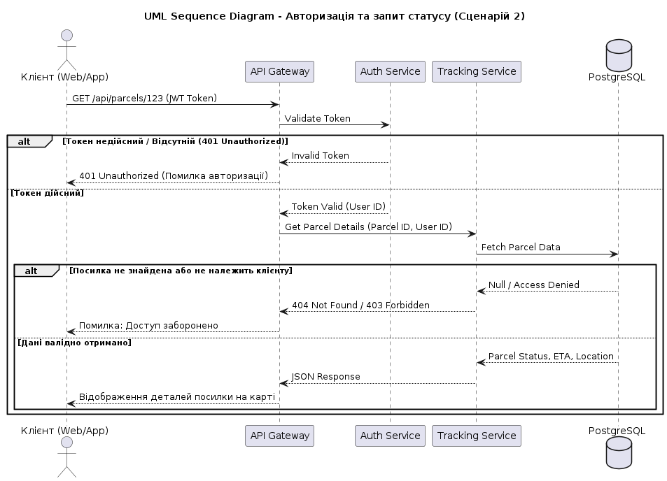
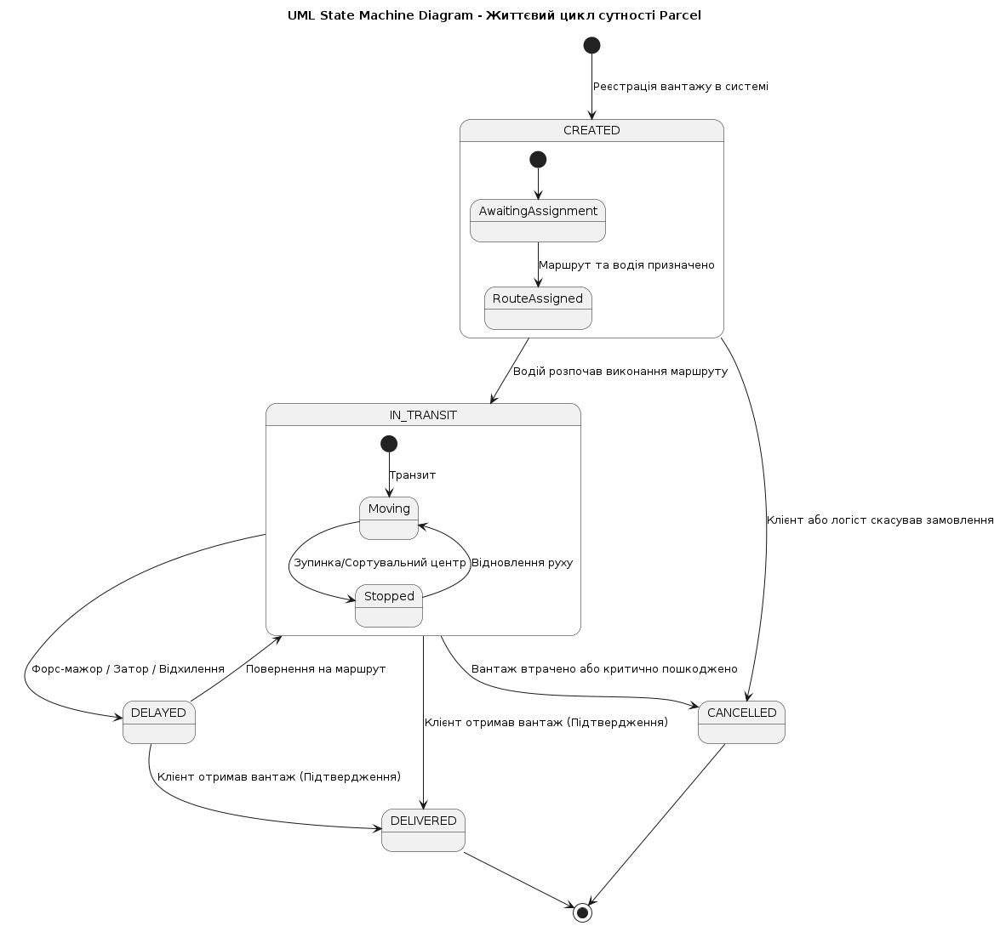

## Розділ 1: С4 Model (Level 1 Context & Level 2 Container)

### 1.1. C4 Level 1: System Context Diagram
**Опис:**
Діаграма контексту визначає межі розроблюваної системи «Smart IoT Logistics System» та демонструє її взаємодію із зовнішнім світом. Головною метою системи є забезпечення моніторингу переміщення вантажів у реальному часі, розрахунок маршрутів та своєчасне інформування користувачів.

* **Клієнт:** Відстежує статус посилок.
* **Водій:** Безперервно генерує GPS-телеметрію.
* **Логіст:** Керує маршрутами.

### 1.2. C4 Level 2: Container Diagram
**Опис:**
Діаграма контейнерів розкриває внутрішню структуру системи.

* **Точки входу:** Mobile App, Web Portal, API Gateway (HTTPS/JSON).
* **IoT Telemetry Service:** Приймає високочастотну GPS-телеметрію від водіїв через gRPC та зберігає в InfluxDB (Time-Series).
* **Асинхронна комунікація:** Використовується RabbitMQ (AMQP) для передачі подій між мікросервісами, що забезпечує неблокуючу роботу системи сповіщень.

## Розділ 2: UML Component Diagram та UML Class Diagram доменної моделі

### 2.1. UML Component Diagram (Tracking & Routing Service)
**Опис:**
Компонентна діаграма деталізує Tracking & Routing Service. Він експонує надані (Provided) інтерфейси ITrackingAPI та IRoutingAPI для клієнтів, і використовує запитувані (Required) інтерфейси бази даних (IDatabaseRepository), картографії (IMapsProvider) та брокера повідомлень.

### 2.2. UML Domain Class Diagram
**Опис:**
Доменна модель включає ключові сутності предметної області. Усі поля інкапсульовано. Продемонстровано асоціацію між клієнтом та посилкою, а також строгу композицію між Route та Waypoint.

## Розділ 3: UML Sequence Diagram та UML State Machine Diagram

### 3.1. UML Sequence Diagram (Сценарії alt, opt, loop)
**Опис:**
Перший сценарій відображає збір телеметрії (оператор loop). Якщо транспорт відхиляється від маршруту (оператор alt), відбувається перерахунок. У разі затримки опціонально (opt) відправляється SMS клієнту.
Другий сценарій демонструє обробку запиту статусу з валідацією токена, де alt обробляє помилку 401 Unauthorized.

### 3.2. UML State Machine Diagram
**Опис:**
Життєвий цикл посилки від створення (CREATED) через транзит (IN_TRANSIT) з можливістю затримки (DELAYED) до успішної доставки (DELIVERED) або скасування.

